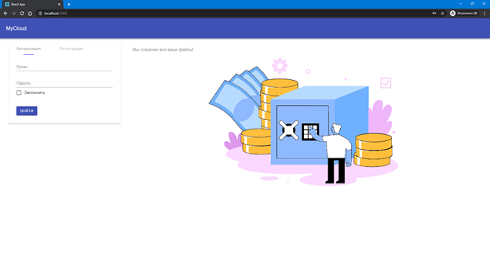
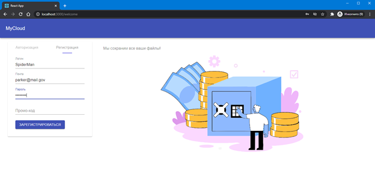
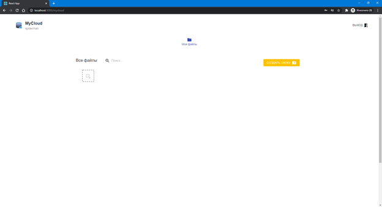
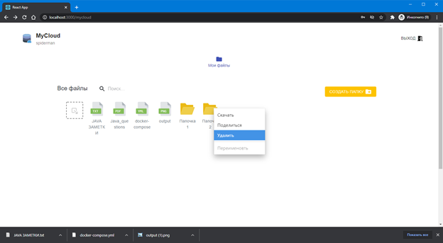
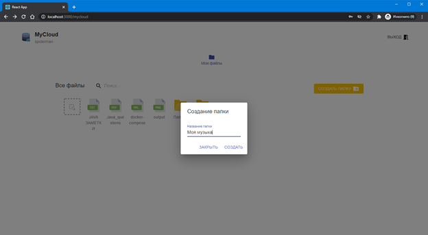
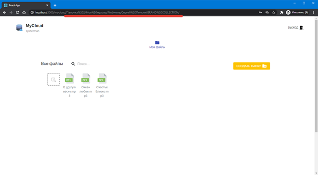

# Cloud File Storage Application (Course project on web programming)

## Introduction

In today's digital landscape, successful enterprises are increasingly moving away from native solutions for various application tasks and adopting web applications, which are often implemented using microservice architecture. Both native software and modern web applications have their pros and cons, but they typically operate in conjunction with a server that handles the majority of data processing. The server is the most critical component of the entire platform.

Servers can be implemented using a wide range of programming languages, such as Golang, Python, Java, Node.js, C++, and more. However, instead of using basic TCP interactions, developers often rely on frameworks that eliminate boilerplate code and reduce the need for custom, ad-hoc solutions.

In this project, we explore the development of a web application by creating a "cloud file storage" application. We will cover the necessary theoretical background, implement the server using the Java programming language with the Spring Framework, and develop the client-side using ReactJS. Finally, we will draw conclusions based on the results achieved.

## Chapter 1: Server-Side Development

### 1.1 Theoretical Background

#### 1.1.1 Spring Framework

Spring Framework provides a comprehensive programming and configuration model for modern Java-based enterprise applications. It focuses on providing infrastructure support at the application level, allowing developers to concentrate on business logic without being bogged down by environment-specific configurations.

#### 1.1.2 Spring MVC

Spring MVC is a key part of the Spring Framework, built around the `DispatcherServlet` that dispatches requests to handlers. It supports flexible request mapping, localization, time zones, and more. The default handler is based on annotations like `@Controller` and `@RequestMapping`, which offer a wide range of flexible methods for handling requests. Since Spring 3.0, the `@Controller` mechanism also allows the creation of RESTful web applications using annotations like `@PathVariable`.

#### 1.1.3 Maven

Maven is a build automation tool used primarily for Java projects. It uses a Project Object Model (POM) file (`pom.xml`) to manage project dependencies, build configurations, and plugins. Spring Boot, which is included in the Spring Framework, simplifies the process of building and running Spring applications.

#### 1.1.4 JPA

Java Persistence API (JPA) is a specification for object-relational mapping (ORM) in Java. It provides an API for managing persistent objects and their relationships. Hibernate is one of the most popular implementations of JPA, offering tools for automatic query generation and data retrieval, significantly reducing development time.

#### 1.1.5 REST API Documentation

Microservice architecture relies on independent services communicating with each other, often using REST as the communication protocol. REST, however, is not self-descriptive, meaning clients need to know the specific combination of URLs, HTTP methods, and response formats. Tools like Swagger or SpringDoc can automatically generate API documentation, making it easier to maintain and update.

### 1.2 Development of the REST API Server Using Spring Framework

#### 1.2.1 Database Design

We chose PostgreSQL as our relational database management system. The database schema includes entities such as `Client`, `FileStorage`, `Promo`, `Session`, and `File`. The relationships between these entities are defined in the database schema diagram.

#### 1.2.2 Entity Models

The server-side application includes the following entity models:

- **Client**: Represents a user of the system.
- **FileStorage**: Represents the file storage associated with a client.
- **Session**: Manages user sessions and authentication tokens.
- **Promo**: Handles promotional codes for additional storage space.
- **File**: Represents files stored in the cloud.

#### 1.2.3 API Functions

The server provides the following REST API endpoints:

- **User Registration**: `/api/v1/client/register`
- **User Login**: `/api/v1/client/login`
- **List Files**: `/api/v1/mycloud/**`
- **Upload File**: `/api/v1/upload/mycloud/**`
- **Download File**: `/api/v1/download/mycloud/**`
- **Create Folder**: `/api/v1/mkdir/mycloud/**`
- **Delete File/Folder**: `/api/v1/delete/mycloud/**`
- **Check Token Validity**: `/api/v1/session/checkToken`

#### 1.2.4 REST API Documentation with SpringDoc

We used SpringDoc to automatically generate REST API documentation, which is accessible at `http://localhost:8181/swagger-ui/index.html`.

## Chapter 2: Client-Side Development

### 2.1 Theoretical Background

#### 2.1.1 ReactJS

React is a JavaScript library for building user interfaces. It allows developers to create reusable UI components and manage the state of an application efficiently. React is widely used for single-page applications (SPAs) and mobile applications.

#### 2.1.2 Axios

Axios is a JavaScript library for making HTTP requests. It supports promises and automatically transforms JSON data, making it easier to work with APIs compared to the native `fetch` function.

#### 2.1.3 Routing

Routing is essential for any web application to navigate between different pages or views. We used `react-router` to handle routing in our application.

#### 2.1.4 Material UI and Bootstrap

Material UI and Bootstrap are popular front-end frameworks that provide pre-designed components and styles for building responsive and visually appealing web applications.

### 2.2 Client-Side Development

#### 2.2.1 Interaction with the REST API

We created a custom React hook (`useApiHook`) to handle all API calls to the server. This hook manages user authentication, file uploads, downloads, and other interactions with the server.

#### 2.2.2 Routing Implementation

We implemented routing using `react-router`, defining routes for different pages such as the welcome page, file storage page, and shared file page.

## Chapter 3: Dockerization

### 3.1 Containerization

Docker allows us to package our application and its dependencies into containers, ensuring consistency across different environments. We created Docker containers for both the server and client applications.

### 3.2 Docker Compose

We used Docker Compose to manage multiple containers, including the PostgreSQL database, the Spring Boot server, the React client, and a MinIO file storage server. The `docker-compose.yml` file defines the configuration for these services.

## Screenshots

- **Login Page**: The user authentication interface.

- **Registration Page**: The form for new user registration.

- **Main Page**: The file storage interface with uploaded files and a dropdown menu.

- **Folder Creation Modal**: A modal for creating new folders.

- **File Navigation**: Demonstrates the routing when navigating through subfolders.

## Conclusion

In this project, we explored client-server architecture and developed a web application using ReactJS for the client-side and Java Spring for the server-side. The application follows REST API principles for communication between the client and server. We used Docker for containerization, ensuring scalability and ease of deployment. The project highlights the importance of modern web development practices, including microservice architecture, RESTful APIs, and containerization.

---

For more details, refer to the full documentation "РГЗ по WEB и JAVA.docx"